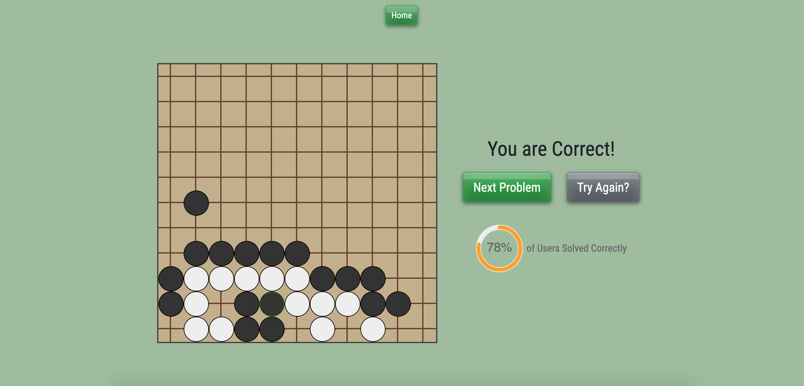

# README

## Frontend
[tsumego-solver-frontend](https://github.com/ellenupark/tsumego-solver-frontend)

<!-- ## Project Demo

[tsumego-solver.herokuapp](https://learn-hwatu.herokuapp.com/) | [Summary Video](https://www.youtube.com/watch?v=deORxiINv8I) -->

## Description



Improve your Go knowledge by completing Life & Death practice problems. 
Create your own or browse through user created problems.

Tsumego Solver was built with a React frontend and a Ruby on Rails backend.

## Install

### Clone Frontend and Backend Repositories

```shell
git clone git@github.com:ellenupark/tsumego-solver-frontend.git
git clone git@github.com:ellenupark/tsumego-solver-backend.git
```

### Initialize the Database

Navigate to the Backend root directory.

```shell
rails db:create 
rails db:migrate 
rails db:seed
```

### Begin Server

While in the Backend root directory,

```shell
rails s
```

### Open Application
Navigate to the Frontend root directory,

```
yarn start
```

## Contributing
Bug reports and pull requests are welcome on GitHub at https://github.com/ellenupark/tsumego-solver-frontend or https://github.com/ellenupark/tsumego-solver-backend. This project is intended to be a safe, welcoming space for collaboration, and contributors are expected to adhere to the [Contributor Covenant](http://contributor-covenant.org) code of conduct.

## License

The application is available as open source under the terms of the [MIT License](https://opensource.org/licenses/MIT).

## Further Information
[Personal Website](https://ellenupark.github.io) | [LinkedIn](http://www.linkedin.com/in/ellenupark) | [Blog](https://ellen-park.medium.com/)